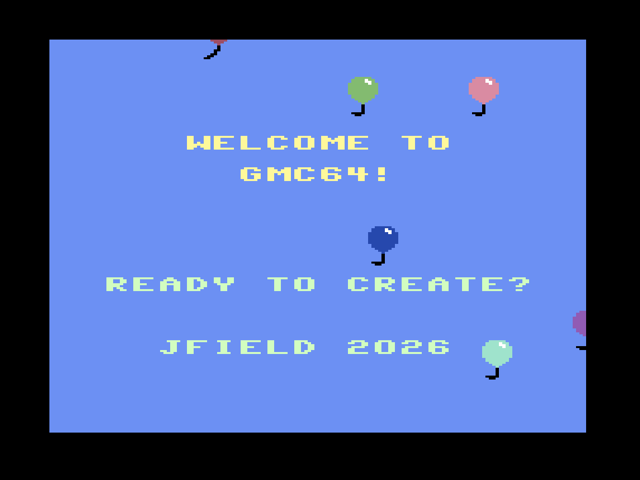
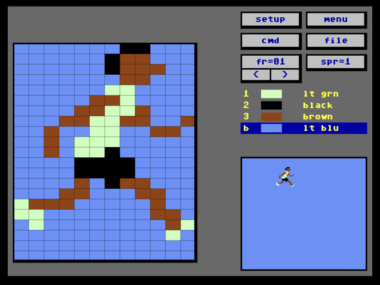
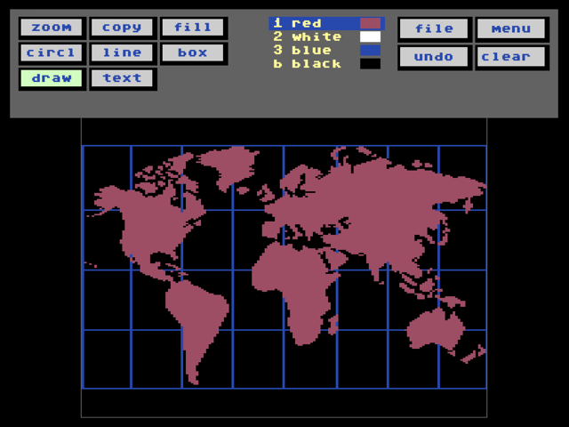
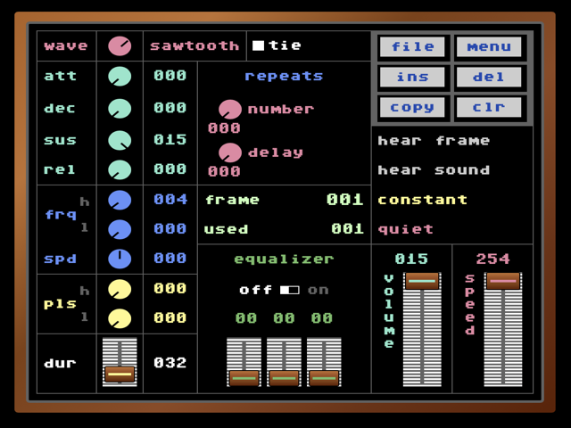
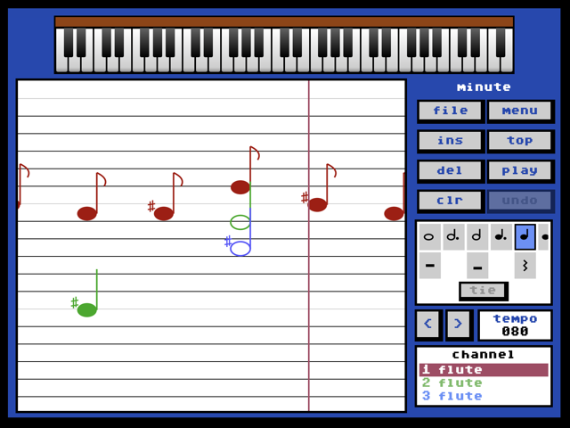
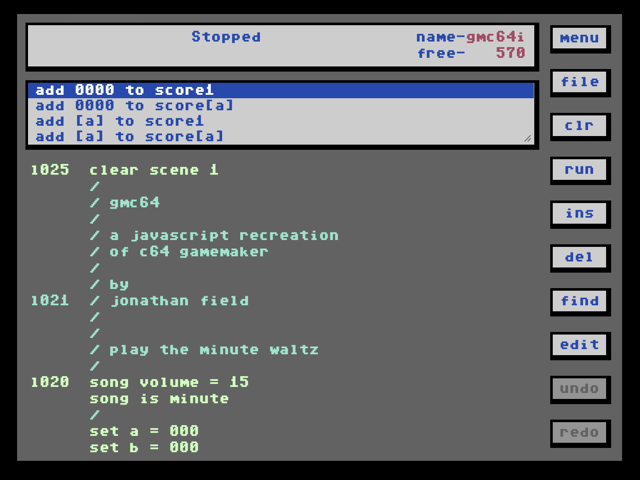

# gmc64

A faithful, browser-based recreation of the 1985 Commodore 64 game-creation tool by Garry Kitchen.

<table>
  <tr>
    <td align="center"><a href="https://gmc64.com/editor.html?play_demo=1"></a><br><sub>Intro demo</sub></td>
    <td align="center"><a href="https://gmc64.com/sprite-maker.html"></a><br><sub>Sprite maker</sub></td>
    <td align="center"><a href="https://gmc64.com/scene-maker.html"></a><br><sub>Scene maker</sub></td>
  </tr>
  <tr>
    <td align="center"><a href="https://gmc64.com/sound-maker.html"></a><br><sub>Sound maker</sub></td>
    <td align="center"><a href="https://gmc64.com/music-maker.html"></a><br><sub>Music maker</sub></td>
    <td align="center"><a href="https://gmc64.com/editor.html"></a><br><sub>Program editor</sub></td>
  </tr>
</table>

---

## If you used GameMaker back then

You probably remember the joy of stitching a game together from sprites and scenes you drew pixel by pixel, the BASIC-adjacent instruction list, the SID sounds you tweaked for hours, the comments scrolling under your title screen.

If you ever burned your work to a `.d64` and spent an afternoon trying to coax it back to life in VICE — only to wrestle with disk drive autoboot, joystick mapping, and emulator timing — this is for you.

Drop your old disk in. Pick your program. Click run. It just plays.

You can also open it up, edit it, change the music, add a sprite, save it back to the disk image, and export it as a single self-contained HTML file you can email to someone or post on a forum. Send your game to a friend the way you wish you could in 1986.

## If you're new to GameMaker

GameMaker was a game-creation tool for the Commodore 64, published by Activision in 1985 and written by Garry Kitchen. It let kids build real, runnable C64 games without learning assembly. You drew sprites and backgrounds, composed music, recorded sound effects, and wrote game logic as a list of plain-English instructions:

```
sprite 1 is PLAYER
sprite 1 x position = 160
sprite 1 y position = 100
if joystick 1 is left then sprite 1 direction = left
```

Many people who grew up to be game developers got their start here. It's been mostly inaccessible since.

GMC64 brings it back — same sprites, same instructions, same sound, in your browser.

## Two-way compatibility

GMC64 isn't only an emulator for old files. It implements the same on-disk formats — `.D64`, `.PRG`, `.SPR`, `.PIC`, `.SND`, `.SNG` — and they round-trip cleanly in both directions.

A game built here saves to a real disk image that loads on an actual Commodore 64 running the original 1985 GameMaker disk. Anything authored on that hardware loads here without translation. New creations can ship to a 1541. Old creations can ship to a tweet.

## Quick start

Open `editor.html` in any modern browser. That's it. No install.

Then either:

- **Load a `.d64`** you already have, pick a `.PRG`, and hit run
- **Try the demos** — `disks/GMC64-DEMO.d64` ships with the project and includes runnable programs and editable sprites, scenes, and songs
- **Start from scratch** — author sprites, scenes, music, and a program from blank

When your game is ready, hit **Export Game** to get a single HTML file that boots straight into your creation, embeddable anywhere.

## Sharing your game

Every editor takes URL parameters, so you can hand someone a direct link to a specific program or drop the player into a page you're building.

### Player (`play.html`) — chrome-free, iframe-friendly

| Param | Purpose |
|-------|---------|
| `disk` | `.d64` URL, or the magic value `demo` for the bundled demo disk |
| `file` | Program name on the disk (case-insensitive) |
| `nocredit=1` | Hide the `gmc64.com` corner link |
| `poster_seconds` | How many seconds to simulate the game for the preview frame behind the play button. Default `2`, max `10`, `0` skips the poster entirely. Decimals allowed. |

Example — direct link:

```
https://gmc64.com/play.html?disk=demo&file=ALIENS/PRG&nocredit=1
```

### Editor (`editor.html`) — loads into the editor, optionally plays

| Param | Purpose |
|-------|---------|
| `disk` | Same as above |
| `file` | Same as above |
| `play=1` | Show a play-button overlay with a poster preview when the page opens. Visitor clicks play to run, clicks the stop button to drop into the editor. Without this flag the file just opens for editing. |
| `poster_seconds` | Same as above; only meaningful with `play=1` |
| `play_demo=1` | Alias — expands to `disk=demo&file=GMC64I/PRG&play=1&poster_seconds=8.5` |

Example — send someone a runnable link that still lets them peek behind the curtain:

```
https://gmc64.com/editor.html?disk=https://your-host.com/game.d64&file=GAME/PRG&play=1
```

The other editors (`sprite-maker.html`, `scene-maker.html`, `sound-maker.html`, `music-maker.html`) accept `disk` and `file` too — deep-linking straight to a specific asset for editing.

### Iframe embed

Two ways to get an embeddable game, depending on what you're willing to host.

**Option A — self-contained HTML.** Use the editor's **Export Game** button. It downloads a single HTML file containing your program, the disk image, and the runtime. Host it anywhere (GitHub Pages, Netlify, S3, your own server), then embed it. The Export dialog also generates the iframe snippet for you — just paste the URL where you'll host the file:

```html
<iframe src="https://your-site.com/mygame.html"
        width="640" height="500"
        allow="autoplay" loading="lazy"
        frameborder="0"></iframe>
```

**Option B — `play.html` + a hosted `.d64`.** Skip export. If your disk image is already at a public URL, point `play.html` at it directly:

```html
<iframe src="https://gmc64.com/play.html?disk=https://your-host.com/game.d64&file=GAME/PRG"
        width="640" height="500"
        allow="autoplay" loading="lazy"
        frameborder="0"></iframe>
```

For the bundled demo disk on gmc64.com, this option needs no hosting at all — the Export dialog pre-fills the URL when you're on the demo disk. Both attributes (`allow="autoplay"`, `loading="lazy"`) matter: the first lets browsers unlock audio from the click-to-play gesture, the second stops multiple embeds on one page from all booting at once.

**Cross-origin disks:** for option B, if your `.d64` lives on a different domain than the page hosting `play.html`, that origin needs to allow cross-origin fetches (CORS). Option A avoids this entirely — the disk is inside the HTML.

## What's included

| File | What it edits |
|------|---------------|
| `editor.html` | Program instructions + runtime + asset assignment |
| `sprite-maker.html` | Sprites (multi-frame, multi-color, multi-quad) |
| `scene-maker.html` | Backgrounds (160×200 indexed-color scenes) |
| `sound-maker.html` | Sound effects (SID-style) |
| `music-maker.html` | Songs (3 channels, score-style staff editor) |

All five editors read and write to the same in-browser `.d64` image, so your sprites flow into scenes flow into programs the same way they did on the C64.

## Dependencies

**To play and edit: none.** It's static HTML and JavaScript. No build step, no server, no npm. Open the files in a browser and use them. They also run from `file://` (just double-click).

**To rebuild the standalone bundle:** Node.js. Pure built-ins, no `npm install` needed. After editing `play.html` or any file it loads from `js/`, run:

```
node tools/bundle-standalone.js
```

This regenerates `js/standalone-source.js` — a snapshot of `play.html` with every `<script src>` inlined, used by the editor's "Export Game" flow to produce a self-contained playable HTML file.

**To run the test suite:** the test tooling lives in `dev/` (kept out of the project root so static hosts don't mistake this for a Node project). One-time setup:

```
cd dev
npm install
```

Then from `dev/`:

```
npm test                 # run the full suite
npm run generate-golden  # regenerate golden files after intentional changes
```

This pulls in vitest (test runner) and puppeteer (headless browser). Only contributors need this.

## Status

Version 1.0. Real period games run faithfully — sprites, scenes, sound effects, music, and program logic all reproduce the original behavior. Reports of edge cases are welcome.

The editor is past the point where I find it more comfortable than the original.

**Honest limitations:**

- **Instruction-loop timing is close, not cycle-accurate.** The JavaScript runtime executes program steps in batches per frame rather than at a fixed C64 clock rate, so games whose visuals are choreographed against the exact duration of a tight instruction loop may drift slightly. None of the period games tested so far — including the original GM intro, which leans on this — drift far enough to look wrong. Programs driven by input, movement, collisions, and `pause for X.X` (which is wall-clock) play indistinguishably from the original.
- **Music-maker instrument sounds aren't fine-tuned to the original GM voices.** Each instrument plays the right notes at the right times, but the timbres are approximations rather than careful matches to the C64 SID presets the original tool shipped. A song composed in real GM will play recognizably here; one composed here and re-loaded into real GM will sound a little different. Polish target, not a structural issue.
- **Music and sound effects don't steal voices from each other.** The C64's SID has exactly three voices total, so when a sound effect plays during music, it interrupts whichever music channel it lands on for the duration of the effect. We use Web Audio, which has effectively unlimited concurrency, so music and sound effects layer freely. Programs sound *fuller* here than on real hardware — every note plays through. If your music and effects were designed around the original interruption behavior (some games used it for percussive accents during music), the interaction will feel different.

## Technical notes

- File format details (`.PRG`, `.SPR`, `.SND`, `.SNG`, `.PIC`, `.D64`)
- Architecture decisions
- Coordinate system, timing formulas, multi-part sprites

All documented in [`CLAUDE.md`](CLAUDE.md) — written for both AI coding assistants and humans who want to dig in.

## Disclaimer

GMC64 is an independent, unaffiliated, clean-room re-implementation made for preservation, education, and fun. It is not affiliated with, endorsed by, or connected to Activision, Activision Blizzard, Microsoft, or any other rights holder. "GameMaker" and any related marks are property of their respective owners. None of the original 1985 code is used or included.

The repository does not contain any commercial disk images or programs. If you have an original GameMaker disk, you can use it with GMC64 yourself; obtain disk images through legal channels.

## License

[MIT](LICENSE). Do what you like with the engine and editors.

The included demos (`disks/GMC64-DEMO.d64`) are original work, also under MIT.
